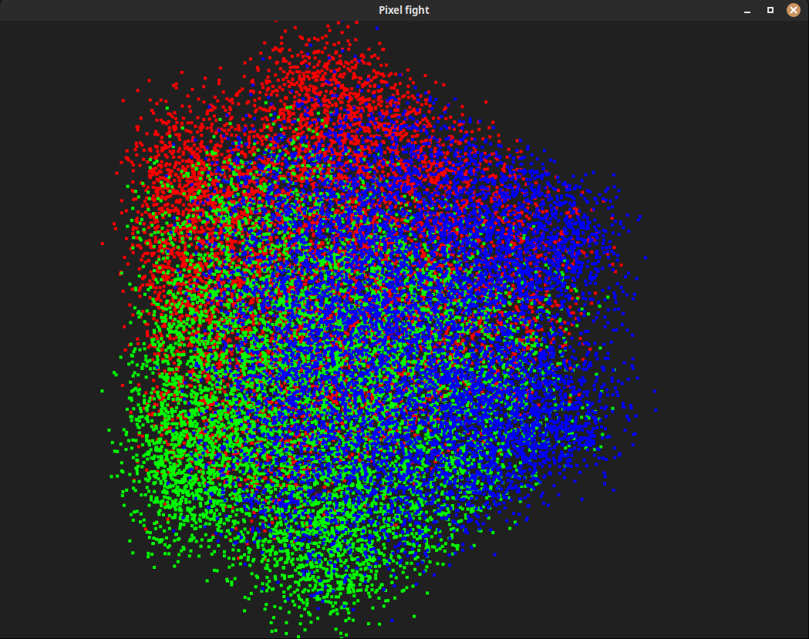

# Pixel Fight /rs



## Description

A very simple zero-player fight simulator between groups of squares.

## Usage

```sh
    USAGE:
        pixel_fight <SUBCOMMAND>

    OPTIONS:
        -h, --help    Print help information

    SUBCOMMANDS:
        example    Dumps an example fight configuration to stdout
        run        Runs a fight from a configuration file
```

## Installation

can be installed with rustup/cargo:
```sh
cargo install pixel_fight
```